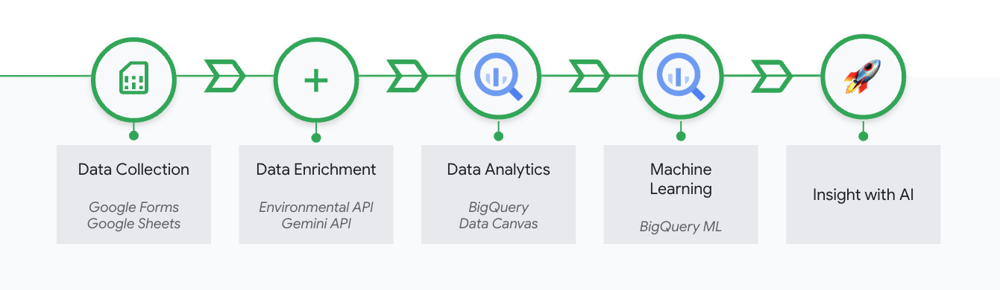
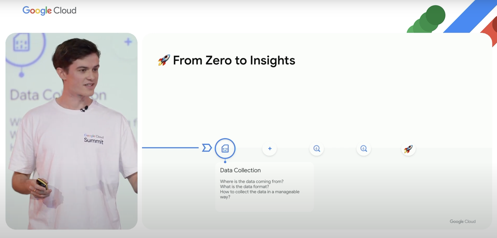

# Data Done Right: From Raw Data to AI Insights, Fast | For Startups 🚀

This Jupyter Notebook provides a rapid, data-driven framework tailored for startups, demonstrating how to extract AI insights from raw data quickly and efficiently within the Google Cloud ecosystem. We focus on a simple but powerful use case: predicting happiness scores based on air quality metrics. 😊

*Please note: The use case presented in this notebook is a fictional scenario created for illustrative purposes. It serves as inspiration for demonstrating data analysis and machine learning techniques on Google Cloud, and should not be interpreted as a scientifically validated study. 💡*

## Project Overview

For startups, speed and efficiency are paramount. This notebook demonstrates how to leverage Google Cloud services to rapidly move from raw data to actionable AI insights, without the need for extensive resources or complex setups. We explore the hypothetical relationship between air quality and happiness, showcasing a practical approach for startups to gain data-driven insights. 📈

## Architecture

## What Startups Will Learn

* **Rapid Prototyping on Google Cloud:** How to quickly set up and utilize Google Cloud services for data analysis and AI prototyping. ☁️
* **Cost-Effective Data Acquisition:** Leveraging external APIs for data acquisition, minimizing initial data collection costs. 💰
* **Agile Data Enrichment with Gemini:** Utilizing Gemini to generate synthetic data for rapid dataset expansion and testing. ✨
* **Scalable Data Analysis with BigQuery:** How to leverage BigQuery for scalable and cost-effective data warehousing and analysis. 📊
* **Lean Machine Learning with SQL:** Training machine learning models directly within BigQuery using SQL, minimizing the need for specialized machine learning expertise. 🤖
* **Leveraging LLMs for Startup Innovation:** Exploring how LLMs can be utilized to rapidly enhance data analysis, and product development within your startup. 🧠

## Key Components

* **Google Cloud for Startups:** Tailored workflow for rapid prototyping and deployment on Google Cloud. 🌈
* **Agile Data Strategies:** Emphasizing efficient data acquisition and enrichment for startups with limited resources. ⚡
* **BigQuery for Scalable Growth:** Utilizing BigQuery for cost-effective and scalable data analysis as your startup grows. 🚀
* **SQL-Powered MVP AI:** Building Minimum Viable Product (MVP) AI models with SQL, enabling rapid iteration and testing. ✅
* **LLMs as Startup Accelerators:** Leveraging LLMs get data insights and accelerate product development. 🌟

## Notebook Structure

1.  **Introduction: Data Done Right for Startups on Google Cloud:** Setting the stage for a rapid, startup-focused data-to-insights workflow on Google Cloud. 🏁
2.  **Rapid Data Acquisition from Environmental API:** Quickly retrieving data from external sources. 🌐
3.  **Agile Data Enrichment with Gemini:** Using Gemini to generate synthetic data for rapid dataset expansion. 📝
4.  **Scalable Data Ingestion & Exploration in BigQuery:** Leveraging BigQuery for efficient data warehousing and analysis. 🔍
5.  **Rapid MVP Model Training (SQL) in BigQuery:** Training a machine learning model using SQL for fast prototyping. 🎯
6.  **Quick Insight Generation & LLM Application for Startup Innovation:** Generating actionable insights and exploring LLM applications. 💡

## How to Run

1.  Clone or download the files from this repository. 📥
2.  Ensure you have a Google Cloud project with the necessary credentials. 🔑
3.  Open the Jupyter Notebook (`raw_data_to_ai_fast.ipynb`) using, for example, [Colab in Vertex AI](https://console.cloud.google.com/vertex-ai/colab/overview). 💻
4.  If using Colab on Google Cloud, make sure to create a runtime first. [Documentation can be found here](https://cloud.google.com/vertex-ai/docs/colab/create-runtime).
5.  Execute the cells in the notebook sequentially, following the instructions provided. ▶️
6.  Ensure your Google Cloud environment variables or configuration files are correctly set up. ⚙️

## Want to check out a Live Demo showcasing a similar use case?

*Click the image to watch the video.*

## Disclaimer
This repository itself is not an officially supported Google product. The code in this repository is for demonstrative purposes only.
